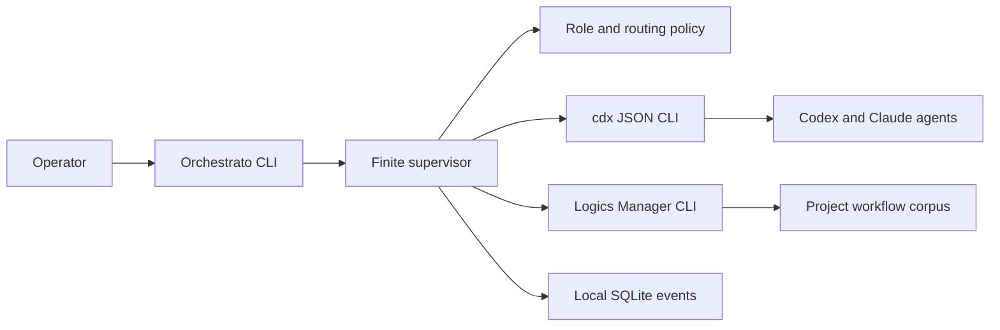

# Orchestrato

Orchestrato is a local conversational supervisor for software development. It presents one operator-facing CLI while coordinating specialized planning, implementation, recovery, and review agents through [cdx-manager](https://github.com/AlexAgo83/cdx-manager), with durable project intent and task state managed by [Logics Manager](https://github.com/AlexAgo83/logics-manager).

The project is currently in product and architecture definition. The first MVP workflow is ready for implementation; no production CLI has been released yet.

## Why

Using several coding agents is easy to start and difficult to govern. The operator has to choose a provider, model, effort level, prompt context, reviewer, retry strategy, and stopping point while keeping the project plan current.

Orchestrato makes those decisions explicit and inspectable:

- stable roles such as planner, executor, recovery, reviewer, and operations;
- deterministic routing with medium reasoning effort by default;
- JSON-first execution through cdx-manager;
- durable request, backlog, task, and context handoffs through Logics Manager;
- finite retries, approvals, independent review, and one writer per worktree;
- local event history that can resume after interruption.

## MVP

The first release is a Python CLI with one-shot and interactive modes. It will support a single repository, local subprocess execution, local SQLite persistence, fake-runtime contract tests, and a compact Rich status display.

A full-screen TUI, distributed workers, concurrent writes, hosted control plane, and unattended deployment are intentionally deferred.

## Architecture



Orchestrato owns orchestration policy and state. cdx-manager owns provider sessions and agent execution. Logics Manager owns product, architecture, backlog, task, validation, and bounded context workflows.

Read the detailed [product brief](docs/product.md), [architecture](docs/architecture.md), and [MVP request chain](logics/INDEX.md).

## Workflow

The canonical MVP chain contains:

- one product request and product brief;
- six implementation backlog slices;
- one coordinating delivery task;
- two architecture decisions;
- one bounded context pack;
- a roadmap from `0.1` to guarded long-running delivery.

Inspect it with:

```bash
logics-manager status
logics-manager flow show req_000_deliver_the_orchestrato_conversational_orchestration_mvp
logics-manager sync context-pack \
  req_000_deliver_the_orchestrato_conversational_orchestration_mvp \
  task_001_orchestrate_delivery_of_the_orchestrato_mvp \
  --format json
cdx view --focus req_000_deliver_the_orchestrato_conversational_orchestration_mvp
```

Validate it with:

```bash
logics-manager lint --require-status
logics-manager audit --group-by-doc
```

## Repository layout

```text
docs/                 Product and technical design
logics/request/       Product requests
logics/product/       Product briefs
logics/architecture/  Architecture decisions
logics/backlog/       Delivery slices
logics/tasks/         Coordinating implementation tasks
logics/context-packs/ Bounded agent handoffs
logics/scaffold/      Reproducible request-chain inputs
```

The first implementation slice follows these product and architecture decisions; later waves remain governed by the linked Logics task.

## Local development

The first vertical slice is now available as a dependency-light Python CLI:

```bash
python3 -m venv .venv
. .venv/bin/activate
python -m pip install -e '.[dev]'
orchestrato --root . --json route "Design the orchestration architecture"
orchestrato --root . --json plan "Implement the first CLI vertical slice"
orchestrato --root . status
python -m pytest
```

The CLI persists local state under `.orchestrato/state.db`, which is ignored by Git. It currently exposes planning, deterministic routing, approval-aware run state, inspection, and offline cdx/Logics adapter contracts. Live provider execution is the next implementation wave.
