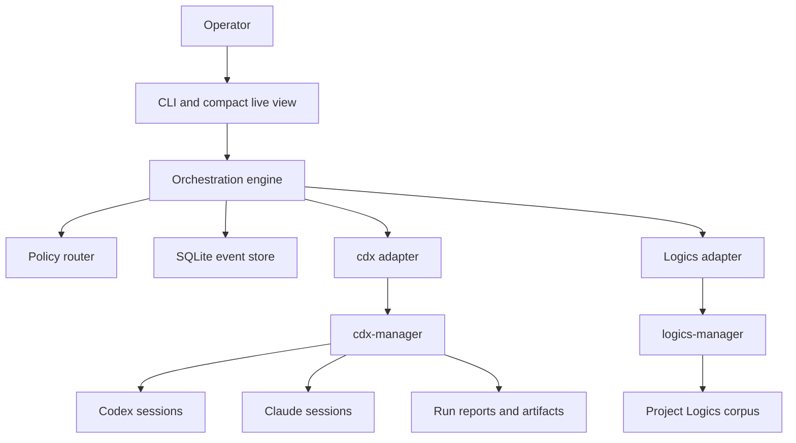
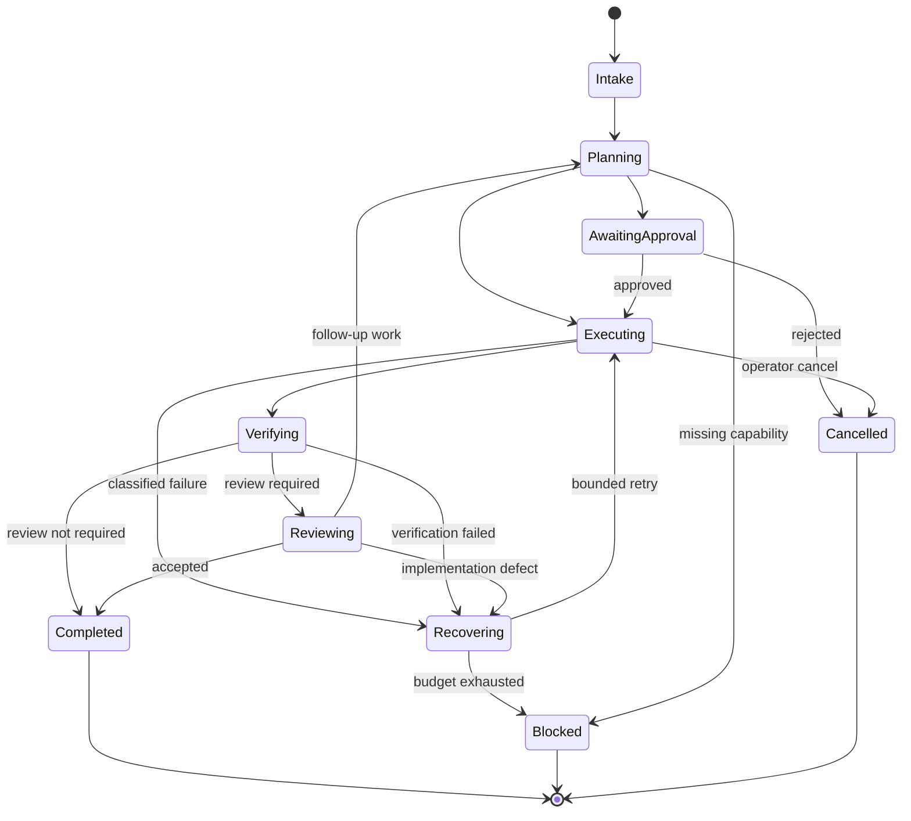

# Orchestrato Architecture

> Status: Proposed
> Updated: 2026-07-26

## System boundary

Orchestrato is a local supervisor, not a provider gateway and not a project-management database.



Ownership is strict:

| Concern | Owner |
| --- | --- |
| Conversation, routing, approvals, budgets, step state | Orchestrato |
| Provider accounts, auth isolation, capacity, launch flags, artifacts, usage | cdx-manager |
| Product, architecture, requests, backlog, tasks, context packs, validation | Logics Manager |
| Repository files and Git history | The target repository and operator policy |

## Technology direction

The MVP should use:

- Python 3.12 or newer;
- `asyncio` subprocesses for external CLI calls;
- Typer for commands and Rich for compact progress;
- Pydantic models at every external JSON boundary;
- SQLite for append-only events and derived snapshots;
- TOML for human-owned role and routing configuration;
- pytest with fake `cdx` and `logics-manager` executables.

This keeps the runtime small, matches the sibling CLI ecosystem, and allows a future Textual interface without changing the domain layer.

## Components

### CLI

Parses operator commands, renders state, and requests approvals. It contains no provider or workflow logic.

### Application service

Accepts objectives and commands, loads current state, asks the policy router for a decision, and dispatches validated state-machine transitions.

### Policy router

Takes normalized task intent, risk, repository state, prior failures, budget, and runtime capability. It returns:

- role;
- provider and model candidates;
- reasoning effort;
- permission;
- review requirements;
- fallback sequence;
- matched rule and explanation.

The router is deterministic for known classes. Optional planner classification can enrich an ambiguous intent but cannot bypass policy.

### Supervisor

Runs one objective as a finite state machine. It persists transition intent before a side effect and result evidence afterward. It owns retry, escalation, approval, and stop rules.

### cdx adapter

Uses only stable machine-readable commands:

- `cdx select --provider ... --min-reasoning-effort ... --json`;
- `cdx run ... --prompt-file ... --reasoning-effort ... --permission ... --json`;
- `cdx run-status <run_id> --json`;
- `cdx run-report <run_id> --json`;
- `cdx runs --json` when reconciliation is required.

The adapter validates schemas and maps external errors into typed domain failures. It stores cdx run IDs and artifact paths, not provider credentials or raw account data. During `cdx run`, it emits normalized selection, start, completion, and waiting events. When cdx has no structured stream, it polls `cdx runs --limit 5 --json` at a bounded interval and reports any active run as an observation; the completed `cdx run` response remains authoritative.

Completed runs also persist one normalized `cost_of_pass` evidence event with route, duration, retries, validation status, raw run reference, and token categories (`input`, `new_input`, `cached_input`, `cache_write`, `output`, `reasoning`, and `total`). Provider pricing is deliberately not inferred by Orchestrato.

### Logics adapter

Uses canonical workflow commands:

- `logics-manager status`, `health`, `lint`, and `audit`;
- `logics-manager flow show`, `new`, `scaffold`, `start`, `progress`, and `closeout`;
- `logics-manager sync read-doc`, `list-docs`, `search-docs`, and `context-pack`.

It never hand-edits managed indicators, lineage, status, or Mermaid signatures.

### Event store

Persists conversations, objectives, steps, routes, approvals, external references, normalized outcomes, usage, and failure classifications. Raw provider artifacts remain in cdx-manager.

### Live execution observation

`orchestrato run --live` attaches a local observer to the same event-publication boundary used for persistence. The CLI writes its timeline to stderr, preserving stdout for `--json` output. With the optional `console` dependency it renders the most recent events as a Rich table; otherwise it emits line-oriented events without an additional dependency.

Each observation receives the SQLite event sequence and timestamp before it reaches the reporter, so `orchestrato inspect <objective_id>` can reconstruct the recorded timeline after the process exits. Payloads are recursively redacted for credential-like keys, long strings are shortened, and oversized payloads are summarized. A waiting event is only liveness evidence while provider streaming is unavailable; the interface deliberately does not infer completion or a progress percentage from it.

## Orchestration state machine



Terminal states have no automatic outgoing transition. A later operator resume creates an explicit new transition with a new budget decision.

## Step transaction pattern

Every external action follows this sequence:

1. derive and validate the next transition;
2. persist `step_intended` with an idempotency key;
3. acquire the required worktree lease and approval;
4. launch the external command;
5. persist the external run identifier as soon as it is known;
6. validate and normalize the result;
7. persist `step_succeeded` or `step_failed`;
8. release the lease;
9. derive the next state.

On restart, reconciliation checks persisted run identifiers through cdx-manager before deciding whether a step may continue. A completed step is not replayed because a later step failed.

## Routing policy

Initial rules are ordered and first-match wins:

| Signal | Route | Effort | Review |
| --- | --- | --- | --- |
| Bounded repository operation | Operations | Low | None unless externally visible |
| Product, architecture, or broad decomposition | Planner | Medium | Operator approval before execution |
| General implementation with clear Logics task | Executor | Medium | Independent review after code changes |
| Configured pure-development specialty | Specialist developer | Medium | Independent review after code changes |
| First ordinary failure with actionable diagnostics | Original executor | Medium | Preserve remaining retry budget |
| Repeated, novel, or cross-system failure | Recovery | High | Verify before resuming |
| Code review or audit objective | Reviewer or auditor | Medium, High for deep audit | Must be independent where configured |

Explicit operator overrides are recorded as decisions. They do not mutate global policy unless the operator edits configuration.

## Agent handoff contract

Agents receive a bounded task packet, not the full orchestration database:

- objective and current step;
- target repository and stable revision;
- active Logics request, backlog, and task references;
- acceptance criteria and validation commands;
- relevant context pack;
- applicable permission and effort;
- prior run report or failure evidence when relevant;
- required structured response shape;
- explicit non-goals and stop conditions.

The packet is projected by role and bounded by a configurable character limit. Oversized packets retain only references and a summary, with a truncation reason recorded in the handoff event. Logics context is fetched only when refs are supplied to the run command; no full transcript replay is the default.

Implementation agents return changed files, validation, blockers, residual risks, and a concise summary. Review agents return severity, file and line when available, rationale, and recommended action. Orchestrato treats free-form prose as display content, not control instructions.

## Failure model

Failures are classified before retry:

- capability unavailable;
- policy or approval denied;
- subprocess timeout or cancellation;
- malformed external protocol;
- provider failure;
- repository conflict or dirty-state hazard;
- validation failure;
- review finding;
- repeated equivalent failure;
- internal invariant violation.

Only failures with new actionable evidence may consume a retry. Equivalent failures decrement the remaining budget and eventually become Blocked.

## Persistence

The first schema can remain compact:

| Table | Purpose |
| --- | --- |
| `conversations` | Repository scope, timestamps, current snapshot |
| `objectives` | Operator intent and terminal outcome |
| `steps` | Stable step identity, kind, state, retry budget |
| `events` | Append-only transition and evidence log |
| `routes` | Matched policy, role, candidates, effort, permission |
| `approvals` | Requested action, scope, decision, actor, expiry |
| `external_runs` | cdx run ID, Logics refs, normalized status, artifacts |
| `worktree_leases` | Single-writer ownership and expiry |

Secrets, provider auth material, and raw environment snapshots are excluded. Prompt storage is configurable and redacted by default.

## Safety and concurrency

- One write lease exists per canonical worktree path.
- Read-only review may run in parallel only against a stable revision.
- Push, deploy, publication, destructive commands, credential access, and permission escalation require explicit approval by default.
- Shell commands are passed as argument arrays, never interpolated strings.
- Prompt and context files use private temporary directories and bounded size.
- External output is untrusted data and cannot directly trigger a transition without schema and policy validation.
- Cancellation propagates to child processes and records a terminal outcome.

## Suggested package layout

```text
src/orchestrato/
  cli.py
  config.py
  domain/
    events.py
    models.py
    policy.py
    state_machine.py
  application/
    commands.py
    supervisor.py
  adapters/
    cdx.py
    logics.py
    sqlite.py
    subprocess.py
  presentation/
    console.py
tests/
  contract/
  integration/
  unit/
```

Dependencies point inward: presentation and adapters depend on application ports; the domain imports neither CLI implementation.

## Evolution

After the single-process MVP is reliable:

1. isolate concurrent tasks in Git worktrees with explicit integration review;
2. add a Textual TUI over the same application service;
3. collect routing outcome metrics and tune policy without automatic self-modification;
4. add a local daemon only when background work and reconnect justify it;
5. define release evidence and guarded long-running autonomy before any unattended publication.

The accepted Logics decisions are `adr_001_keep_orchestrato_behind_cli_contracts` and `adr_002_use_a_persisted_finite_orchestration_state_machine`.
