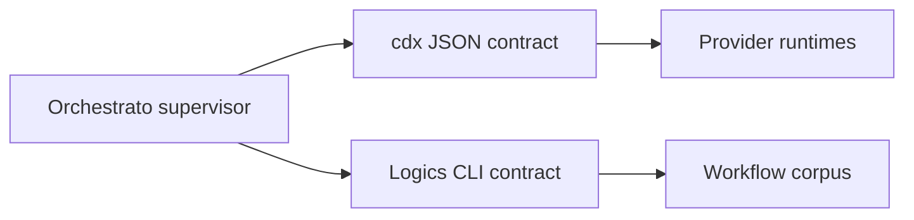

## adr_001_keep_orchestrato_behind_cli_contracts - Keep Orchestrato behind CLI contracts
> Date: 2026-07-26
> Status: Proposed
> Drivers: Stable tool boundaries, provider isolation, workflow ownership, contract testability.
> Related request: `req_000_deliver_the_orchestrato_conversational_orchestration_mvp`
> Related backlog: `item_003_integrate_the_cdx_manager_headless_execution_contract`
> Related task: `task_001_orchestrate_delivery_of_the_orchestrato_mvp`
> Reminder: Update status, linked refs, decision rationale, consequences, and follow-up work when you edit this doc.

# Overview
Orchestrato integrates cdx-manager and Logics Manager through their installed CLI contracts. It does not import sibling-repository internals.

# Context
- cdx-manager already owns provider accounts, availability, provider-native headless launch flags, artifact capture, usage extraction, and run reports.
- Logics Manager already owns workflow documents, lifecycle transitions, context packs, lint, audit, and the local viewer.
- Importing either implementation would couple release cadence, Python environments, and private modules.
- Subprocess boundaries add process overhead, but both tools already expose machine-readable surfaces designed for supervisors.

# Decision
- Orchestrato is a Python application whose integration ports execute `cdx` and `logics-manager` as subprocesses.
- cdx calls use JSON output exclusively and validate the returned schema before changing orchestration state.
- Logics mutations use `logics-manager flow` and `logics-manager sync`; Orchestrato never hand-edits managed indicators, links, signatures, or status.
- Prompts and context packs are passed through bounded files when practical rather than oversized command-line arguments.
- Provider stdout, stderr, transcripts, and credentials remain owned by cdx-manager. Orchestrato persists references and normalized outcomes only.
- Adapter versions and capabilities are probed at startup. Missing or incompatible commands produce a blocked state with a diagnostic.
- Direct library integrations may be reconsidered only if a versioned public SDK exists and materially improves reliability.

# Consequences
- Each tool can evolve independently behind a stable contract.
- Fake executables can test orchestration without provider credentials or sibling source checkouts.
- Every subprocess needs timeout, cancellation, malformed-output, and non-zero-exit handling.
- Cross-tool transactions are compensating workflows rather than database transactions.
- The CLI contract becomes a deliberate compatibility dependency and should be covered by contract fixtures.

# Rejected alternatives
- Import sibling Python modules: rejected because internal APIs and environments are not stable integration boundaries.
- Call providers directly: rejected because it duplicates authentication, account isolation, quota selection, and native launch behavior.
- Store planning only in Orchestrato: rejected because it would duplicate Logics workflow ownership and weaken handoffs.

# Follow-up
- Pin and validate minimum supported CLI capabilities before the first live integration.
- Add fake cdx and Logics executables for deterministic contract tests.
- Document compatibility failures as typed adapter errors.

# References
- Related request: `req_000_deliver_the_orchestrato_conversational_orchestration_mvp`
- Related backlog: `item_003_integrate_the_cdx_manager_headless_execution_contract`
- Related task: `task_001_orchestrate_delivery_of_the_orchestrato_mvp`
- Product brief: `prod_001_orchestrato_mvp_product_brief`
- Detailed architecture: `docs/architecture.md`
