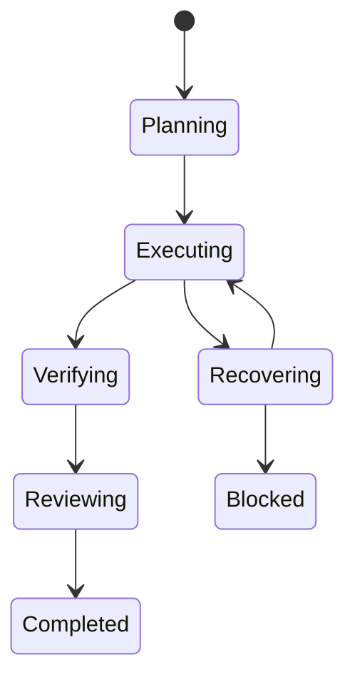

## adr_002_use_a_persisted_finite_orchestration_state_machine - Use a persisted finite orchestration state machine
> Date: 2026-07-26
> Status: Proposed
> Drivers: Resumability, bounded retries, approval safety, crash recovery, auditable agent handoffs.
> Related request: `req_000_deliver_the_orchestrato_conversational_orchestration_mvp`
> Related backlog: `item_005_implement_finite_supervision_review_and_recovery`
> Related task: `task_001_orchestrate_delivery_of_the_orchestrato_mvp`
> Reminder: Update status, linked refs, decision rationale, consequences, and follow-up work when you edit this doc.

# Overview
Orchestrato models each objective as a persisted finite state machine with explicit transitions, side-effect boundaries, retry budgets, and terminal outcomes.

# Context
- Agent runs are non-deterministic and may time out, fail after partial edits, or return malformed reports.
- Recovery and review introduce loops that can become expensive or endless without explicit budgets.
- A process can stop between launching an external run and recording its result.
- Long-term autonomy requires resumability and auditability before it requires more agent intelligence.

# Decision
- Persist append-only orchestration events in a local SQLite database before and after every external side effect.
- Use the main states Intake, Planning, Awaiting approval, Executing, Verifying, Reviewing, Recovering, Completed, Blocked, Cancelled, and Failed.
- Reconstruct current state by replaying events; keep derived snapshots as an optimization, not the source of truth.
- Assign a stable idempotency key to each step and correlate every cdx run and Logics reference with that step.
- Allow one active write-capable run per worktree. Read-only analysis may run concurrently only when it observes a stable revision.
- Apply per-step limits for attempts, agent switches, elapsed time, and estimated usage.
- Enter recovery only for classified failures that have useful new evidence. Repeated equivalent failures terminate as Blocked.
- Require policy approval before high-impact side effects and persist both the request and the operator decision.

# Consequences
- Interrupted sessions can resume from the latest durable transition.
- Routing and failure decisions are auditable without retaining every raw provider token.
- The supervisor has more domain types and transition tests than a prompt-driven loop.
- SQLite is a single-host boundary; distributed workers require a later storage and leasing decision.
- Idempotency cannot undo arbitrary provider side effects, so prompts and adapters must still scope actions carefully.

# Invariants
- No transition starts an external side effect unless its intent is already persisted.
- No two write leases target the same worktree.
- Completed steps are never replayed merely because a later step failed.
- A reviewer required to be independent cannot reuse the implementation run identity.
- Retry and escalation budgets only decrease.
- Terminal states have no automatic outgoing transition.

# Rejected alternatives
- Prompt-only orchestration: rejected because retries, approvals, and resume cannot be enforced reliably.
- An unbounded agent loop: rejected because cost and failure behavior are not controllable.
- A distributed queue in the MVP: rejected because local execution and a single operator do not justify its complexity.

# Follow-up
- Define the transition table and event schema before implementing provider adapters.
- Add crash-boundary and duplicate-resume tests with fake subprocesses.
- Revisit worktree leasing before enabling parallel implementation.

# References
- Related request: `req_000_deliver_the_orchestrato_conversational_orchestration_mvp`
- Related backlog: `item_005_implement_finite_supervision_review_and_recovery`
- Related task: `task_001_orchestrate_delivery_of_the_orchestrato_mvp`
- Product brief: `prod_001_orchestrato_mvp_product_brief`
- Detailed architecture: `docs/architecture.md`
