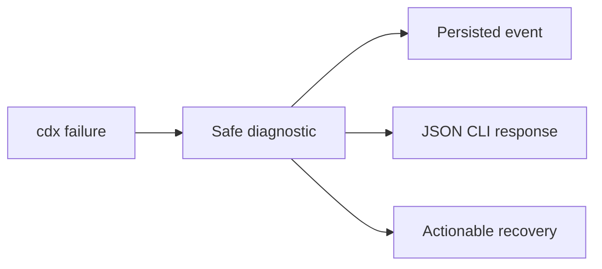

## prod_002_actionable_cdx_failure_reporting - Actionable cdx failure reporting
> Date: 2026-07-27
> Status: Settled
> Related request: `req_002_expose_actionable_cdx_execution_failure_diagnostics`
> Related backlog: `item_008_propagate_structured_cdx_run_failure_diagnostics`
> Related task: `task_003_deliver_actionable_cdx_execution_diagnostics`
> Related architecture: (none yet)
> Reminder: Update status, linked refs, scope, decisions, success signals, and open questions when you edit this doc.

# Overview
Turn opaque cdx execution failures into safe diagnostics that an operator can act on.

# Goals
- Surface the cause of a failed cdx run in the CLI and inspect history.
- Preserve JSON protocol compatibility and secret redaction.
- Keep default verification fully offline.

# Non-goals
- Changing cdx authentication, provider quotas, or session management.
- Parsing interactive provider terminal output.
- Adding cloud telemetry or external error reporting.

# Scope and guardrails
- In: scaffolded request, product, backlog, orchestration task, validation, and handoff context.
- Out: unrelated workflow docs and implementation of generated tasks.

# Key product decisions
- Use structured input as the source of truth for generated docs.
- Keep generated write paths local and repo-bounded.

# Success signals
- Generated docs pass lint and audit without broad manual rewrites.
- Context-pack output can be handed to an implementation agent directly.

# References
- Product back-reference: `item_008_propagate_structured_cdx_run_failure_diagnostics`
- Task back-reference: `task_003_deliver_actionable_cdx_execution_diagnostics`
