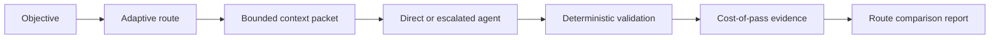

## prod_003_cost_of_pass_control_plane - Cost-of-pass control plane
> Date: 2026-07-28
> Status: Settled
> Related request: `req_003_measure_and_optimize_orchestrato_cost_of_pass`
> Related backlog: `item_010_persist_normalized_cost_of_pass_run_evidence`
> Related task: `task_004_deliver_cost_of_pass_control_plane_and_benchmark_harness`
> Related architecture: (none yet)
> Reminder: Update status, linked refs, scope, decisions, success signals, and open questions when you edit this doc.

# Overview
Make Orchestrato choose and evidence the lowest-cost orchestration route that meets explicit delivery quality gates.

# Goals
- Treat orchestration complexity as a budgeted, evidence-driven decision.
- Separate provider load, billed-token inputs, latency, and successful delivery outcomes.
- Make bounded, role-specific context a first-class handoff artifact.
- Provide reproducible route comparisons for future routing policy changes.

# Non-goals
- Infer provider pricing or publish a universal model ranking.
- Run live providers automatically in CI or during local unit tests.
- Replace cdx-manager usage capture or Logics workflow ownership.

# Scope and guardrails
- In: scaffolded request, product, backlog, orchestration task, validation, and handoff context.
- Out: unrelated workflow docs and implementation of generated tasks.

# Key product decisions
- Use structured input as the source of truth for generated docs.
- Keep generated write paths local and repo-bounded.

# Success signals
- Generated docs pass lint and audit without broad manual rewrites.
- Context-pack output can be handed to an implementation agent directly.

# References
- Product back-reference: `item_010_persist_normalized_cost_of_pass_run_evidence`
- Task back-reference: `task_004_deliver_cost_of_pass_control_plane_and_benchmark_harness`
